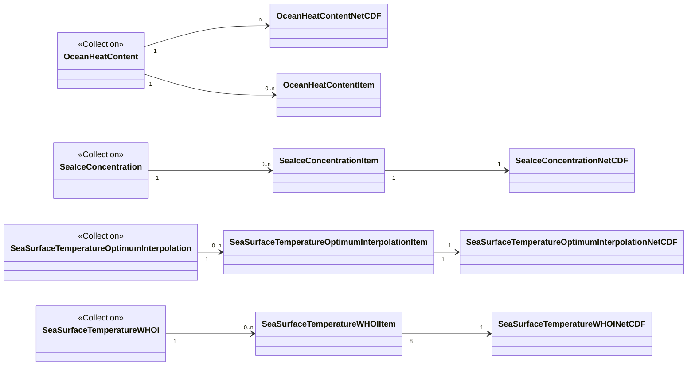

# stactools-noaa-cdr

[](https://pypi.org/project/stactools-noaa-cdr/)

- Name: noaa-cdr
- Package: `stactools.noaa_cdr`
- [stactools-noaa-cdr on PyPI](https://pypi.org/project/stactools-noaa-cdr/)
- Owner: [@gadomski](https://github.com/gadomski)
- [Dataset homepage](https://www.ncei.noaa.gov/products/climate-data-records/)
- STAC extensions used:
  - [item assets](https://github.com/stac-extensions/item-assets)
  - [proj](https://github.com/stac-extensions/projection)
  - [raster](https://github.com/stac-extensions/raster)
  - [scientific](https://github.com/stac-extensions/scientific)
  - [classification](https://github.com/stac-extensions/classification)
- Extra fields:
  - `noaa_cdr:interval`: The time resolution (derived from the
    `time_coverage_resolution` field) of the dataset. Useful for filtering
    multi-temporal-resolution CDRs, such as ocean heat content.
  - `noaa_cdr:max_depth`: The maximum depth of the measurements. Only used for
    `ocean-heat-content`.
- [Browse the example in human-readable form](https://radiantearth.github.io/stac-browser/#/external/raw.githubusercontent.com/stactools-packages/noaa-cdr/main/examples/catalog.json)

## STAC Examples

- Collections
  - [Ocean heat content](examples/noaa-cdr-ocean-heat-content/collection.json)
  - [Sea ice concentration](examples/noaa-cdr-sea-ice-concentration/collection.json)
  - [Sea surface temperature - optimum interpolation](examples/noaa-cdr-sea-surface-temperature-optimum-interpolation/collection.json)
  - [Sea surface temperature - WHOI](examples/noaa-cdr-sea-surface-temperature-whoi/collection.json)
- Items
  - [Ocean heat content, yearly for 2021, 2000m depth](examples/noaa-cdr-ocean-heat-content/ocean-heat-content-2021-2000m/ocean-heat-content-2021-2000m.json)
  - [Sea ice concentration, daily, northern hemisphere](examples/noaa-cdr-sea-ice-concentration/seaice_conc_daily_nh_20211231_f17_v04r00/seaice_conc_daily_nh_20211231_f17_v04r00.json)
  - [Sea surface temperature - optimum interpolation](examples/noaa-cdr-sea-surface-temperature-optimum-interpolation/oisst-avhrr-v02r01.20220913/oisst-avhrr-v02r01.20220913.json)
  - [Sea surface temperature - WHOI](examples/noaa-cdr-sea-surface-temperature-whoi/SEAFLUX-OSB-CDR_V02R00_SST_D20210831_C20211223-0/SEAFLUX-OSB-CDR_V02R00_SST_D20210831_C20211223-0.json)

### Layout

Each Climate Data Record can have multiple subdatasets, which themselves can be
organized by time intervals and other attributes. We have chosen to create one
STAC collection for each CDR, and to organize items in that collection by time
interval and time window. Subdatasets are included as COG assets.

Because each CDR has a different data layout in its NetCDFs, the mapping from
NetCDF(s) to STAC Collections and Items varies from CDR to CDR.
The diagram below is an abstract representation of those layouts.  Note that the
class names do not directly correspond to code entities; this is strictly a
conceptual diagram.  Note too the 8-1 relationship between
`SeaSurfaceTemperatureWHOIItem` and `SeaSurfaceTemperatureWHOINetCDF`; each
SST-WHOI NetCDF contains eight timesteps, and so breaks apart into eight STAC
items per NetCDF.



## Installation

```shell
pip install stactools-noaa-cdr
```

## Command-line Usage

To create a collection, e.g. for the [Ocean heat content CDR](https://www.ncei.noaa.gov/products/climate-data-records/global-ocean-heat-content):

```sh
stac noaa-cdr ocean-heat-content create-collection examples/ocean-heat-content/collection.json
```

To create COGs and items:

```sh
stac noaa-cdr ocean-heat-content create-collection --create-items \
  examples/ocean-heat-content/collection.json
```

To only create COGs and items for the latest data (e.g. to create a small
example collection):

```sh
stac noaa-cdr ocean-heat-content create-collection --create-items --latest-only \
  examples/ocean-heat-content/collection.json
```

Each CDR has its own flavor of command line interface; use `stac noaa-cdr
--help` to see a list of supported CDRs.

## Contributing

We use [pre-commit](https://pre-commit.com/) to check any changes.
To set up your development environment:

```shell
pip install -e .
pip install -r requirements-dev.txt
pre-commit install
```

To check all files:

```shell
pre-commit run --all-files
```

To run the tests:

```shell
pytest
```

### Updating static resources

There are several .json files in the source tree that are used to populate
metadata when creating collections and items.
There are two helper scripts in the `scripts/` directory that update these files.

```sh
scripts/create_item_assets.py
scripts/extract_netcdf_asset_metadata.py > src/stactools/noaa_cdr/ocean-heat-content/asset-metadata.json
```

Additionally, there is a script to create the `examples/` directory:

```sh
scripts/create_examples.py
```
